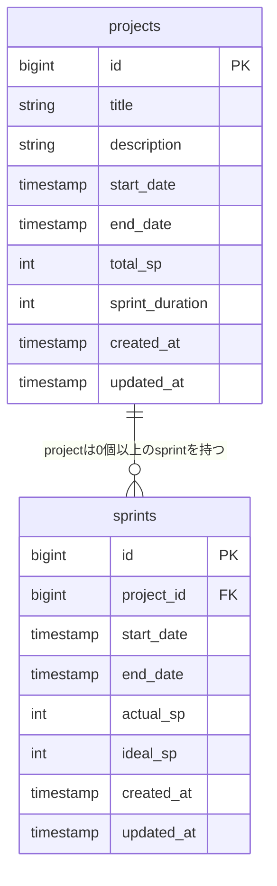

```mermaid
erDiagram
    projects {
        bigint id PK
        string title
        string description
        timestamp start_date
        timestamp end_date
        int total_sp
        int sprint_duration
        timestamp created_at
        timestamp updated_at
    }

    sprints {
        bigint id PK
        bigint project_id FK
        timestamp start_date
        timestamp end_date
        int actual_sp
        int ideal_sp
        timestamp created_at
        timestamp updated_at
    }


    projects ||--o{ sprints: "projectは0個以上のsprintを持つ"
```
